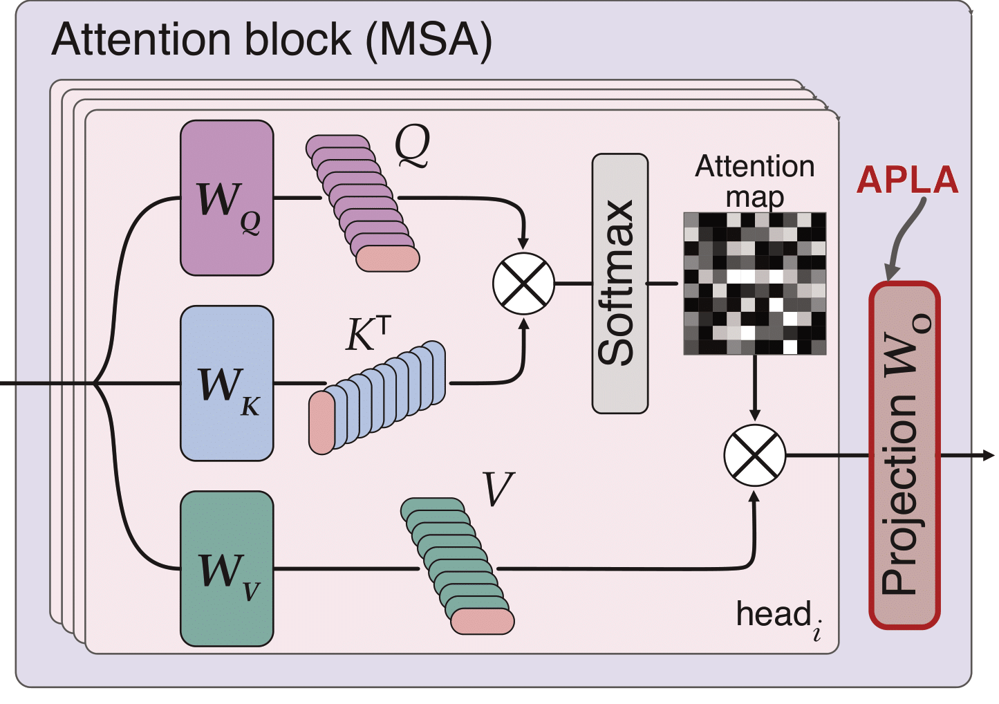

## APLA: A Simple Adaptation Method for Vision Transformers

This repo has implementation for the following papers:
- [APLA: A Simple Adaptation Method for Vision Transformers](https://arxiv.org/abs/2503.11335) 
- [Efficient Self-Supervised Adaptation for Medical Image Analysis](https://arxiv.org/abs/2503.18873)


APLA (Attention Projection Layer Adaptation) is a lightweight yet effective method for adapting Vision Transformers (ViTs).
We identify the projection layer immediately following the attention mechanism as critical for adaptation. 
APLA tunes only this layer—or even a _random_ subset of its weights—without modifying the architecture or adding parameters.
Despite its simplicity, APLA delivers strong performance with remarkable efficiency.


<div align="center" style="margin-bottom: 1px;">
  
  
</div>


<br>

APLA is a targeted adapation approach that tunes only the projection layer immediately following attention.
It does not intorduce any new parameters, and leverages the existing ViT architecture for adaptation.

APLA is versatile and can easily be used for classification, segmentation and detection tasks.
Further, it can seamlessly be employed for both supervised and self-supervised learning.


---
### Simple implementation
APLA can be easily implemented using the [APLA package](./src/apla/appla_attn.py), which provides the implementation of APLA and helper functions to directly replace ```Attention``` module with ```APLA_Attention```.


---
### Installations
Please refer to the [```Dockerfile```](./docker/Dockerfile) and use [```build_docker.sh```](./docker/build_docker.sh) to build the image. 
For self-supervision with dinov2, additional installations are required. You can find the necessary packages in [```conda-dinov2```](./docker/conda-dinov2.yaml). It is recommended to set up a separate conda environment for installing the dinov2 packages.


---
### Datasets
This repository implements many datasets, please refer to 
[```datasets.py```](./src/defaults/datasets.py) 
for their implementation.


---
### Usage
This repository contains code for both supervised and self-supervised adaptation (with dinov2).
#### Supervised adaptation
Each parameter file follows the hierarchy similar to ```params/finetune/dinov2/NABirds/vit_b/apla.yml```
which correponds to supervsied adaptaiton on the ```NABirds``` dataset using APLA, with ```dinov2``` initialization using the ```vit_b``` architecture.

For the APLA parameter file, the ```partial_size``` attribute refers to the APLA rank, which defines how many columns of the projection weight matrix will be tuned.

To do supervised adaptation with APLA run:
```
# code needs to be run from src dir
cd src
python main.py --params_path ../params/finetune/dinov2/NABirds/vit_b/apla.yml
```

#### Self-supervised adaptation
The structure follows a similar pattern as supervised adaptation.
Each parameter file follows the hierarchy similar to ```params/pretrain/dinov2/ISIC2019/vit_b/apla.yml```
which correponds to self-supervsied adaptaiton on the ```ISIC2019``` dataset using APLA, with ```dinov2``` initialization using the ```vit_b``` architecture.

To do self-supervised adaptation with APLA using the dinov2 objective run:
```
# code needs to be run from src dir
cd src
python main.py --dinov2 --params_path ../params/pretrain/dinov2/ISIC2019/vit_b/apla.yml
```

#### Segmentation and Detection
Please refer to the corresponding [README](./src/segmentation_and_detection/REAMDE_SEG_DET.md).


---
### Citation

```bibtex
@article{sorkhei2025apla,
  title={APLA: A Simple Adaptation Method for Vision Transformers},
  author={Sorkhei, Moein and Konuk, Emir and Smith, Kevin and Matsoukas, Christos},
  journal={arXiv preprint arXiv:2503.11335},
  year={2025}
}
```
```bibtex
@article{sorkhei2025efficient,
  title={Efficient Self-Supervised Adaptation for Medical Image Analysis},
  author={Sorkhei, Moein and Konuk, Emir and Guo, Jingyu and Matsoukas, Christos and Smith, Kevin},
  journal={arXiv preprint arXiv:2503.18873},
  year={2025}
}
```

---
### Acknowledgement
This repo is built on 
[medical_transformers](https://github.com/ChrisMats/medical_transformers), [Dinov2](https://github.com/facebookresearch/dinov2), 
[Dino](https://github.com/facebookresearch/dino), 
and 
[timm](https://github.com/huggingface/pytorch-image-models) repositories.
Thanks for their great work.
