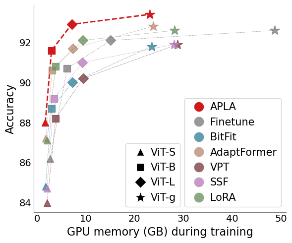
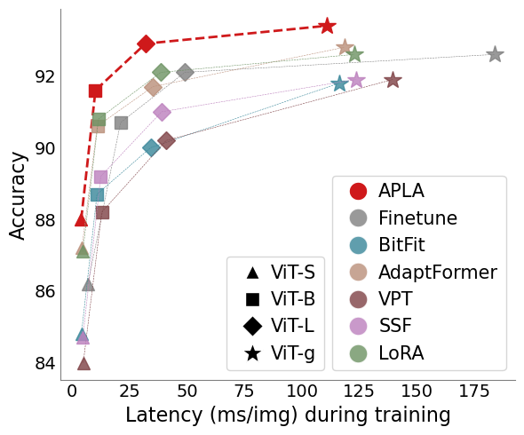
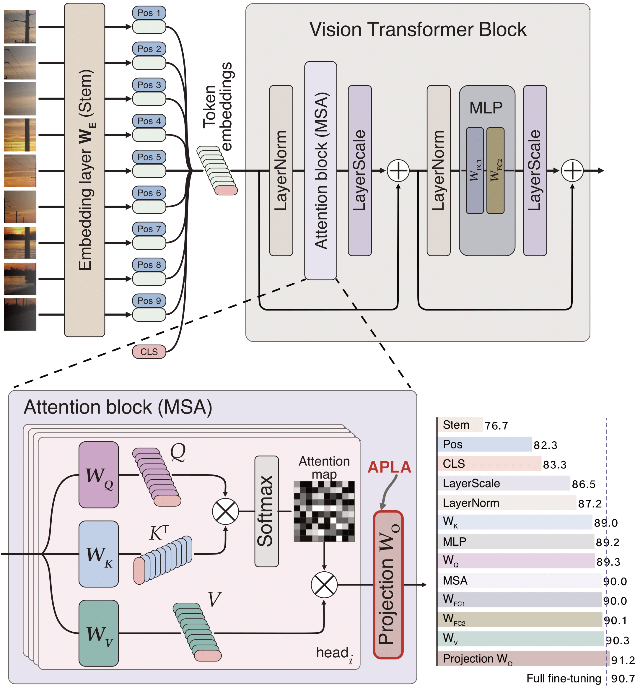

## APLA: A Simple Adaptation Method for Vision Transformers

APLA (Attention Projection Layer Adaptation) is a lightweight yet effective method for adapting Vision Transformers (ViTs).

We identify the projection layer immediately following the attention mechanism as critical for adaptation. 
APLA tunes only this layer—or even a _random_ subset of its weights—without modifying the architecture or adding parameters.

Despite its simplicity, APLA delivers exceptional performance with remarkable efficiency.

  
  

  

### Usage
Code is coming soon!

